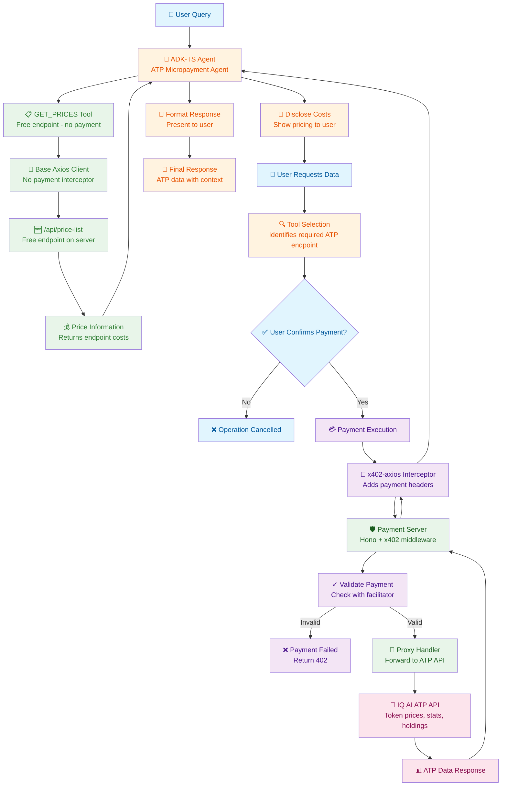

<div align="center">
  
  <br/>
 <h1>ATP Micropayment Agent</h1>
 <b>Example agent demonstrating how to build monetized, pay-per-request AI workflows with ADK-TS and x402</b>
  <br/>
  <i>LLM-powered • x402 Micropayments • IQ AI ATP Integration • TypeScript</i>
</div>

---

Example project showing how to build agents that access paid API endpoints using the x402 micropayment protocol. This sample demonstrates the complete pattern: an ADK-TS agent with payment-enabled tools, a local x402 server that proxies premium endpoints, and user-friendly pricing disclosure. Developers can use this as a foundation for building their own monetized AI services.

## Features

- 💰 **x402 Micropayments**: Automatic payment handling for premium API endpoints using the x402 protocol
- 🔒 **Payment-Gated Tools**: Secure access to IQ AI's ATP data through a local payment server
- 💵 **Transparent Pricing**: Upfront pricing disclosure with user confirmation before charges
- 🌐 **Local Payment Server**: Hono-based x402 proxy that protects ATP endpoints
- 🛠️ **Multi-Tool Architecture**: Demonstrates building agents with multiple payment-enabled tools
- 📊 **ATP Data Access**: Fetch token prices, agent stats, wallet holdings, and leaderboards
- 🎯 **Extensible Pattern**: Easy to adapt for your own monetized AI services
- 💬 **User-Friendly UX**: Clear pricing communication and graceful fallbacks

## Architecture and Workflow

This project demonstrates a complete micropayment-enabled agent architecture:

1. **ADK-TS Agent** - Main conversational agent with x402-enabled tools
2. **Payment Server** - Hono + x402 middleware proxy for ATP endpoints
3. **ATP API** - IQ AI's premium data endpoints (token prices, stats, etc.)
4. **x402 Protocol** - Handles automatic micropayments via wallet integration

### Project Structure

```text
atp-micropayment-agent/
├── src/
│   └── agents/
│       └── atp-agent/
│           ├── agent.ts            # Agent behaviour + instructions
│           └── tools.ts            # Payment-enabled ATP tools
│   ├── server/                         # Payment Server (Hono + x402)
│   │   └── index.ts                    # x402 middleware & ATP proxy routes
│   └── env.ts                          # Shared environment configuration
├── package.json                        # Dependencies and scripts
├── tsconfig.json                       # TypeScript configuration
└── README.md
```

### Data Flow


```mermaid
graph TB
    %% User Interaction
    User[👤 User Query] --> Agent[🤖 ADK-TS Agent<br/>ATP Micropayment Agent]

    %% Initial Price Fetch (Free)
    Agent --> GetPrices[📋 GET_PRICES Tool<br/>Free endpoint - no payment]
    GetPrices --> baseApiClient[📡 Base Axios Client<br/>No payment interceptor]
    baseApiClient --> PriceListEndpoint[🆓 /api/price-list<br/>Free endpoint on server]
    PriceListEndpoint --> PriceResponse[💰 Price Information<br/>Returns endpoint costs]

    %% Agent shows prices to user
    PriceResponse --> Agent
    Agent --> ShowPrices[💬 Disclose Costs<br/>Show pricing to user]

    %% User makes request for paid data
    ShowPrices --> UserRequest[👤 User Requests Data]
    UserRequest --> ToolSelection[🔍 Tool Selection<br/>Identifies required ATP endpoint]

    %% User Confirmation
    ToolSelection --> Confirmation{✅ User Confirms Payment?}
    Confirmation -->|No| Cancel[❌ Operation Cancelled]
    Confirmation -->|Yes| Payment[💳 Payment Execution]

    %% Payment Flow via x402-axios
    Payment --> x402Client[🔐 x402-axios Interceptor<br/>Adds payment headers]
    x402Client --> PaymentServer[🛡️ Payment Server<br/>Hono + x402 middleware]

    %% Server Processing
    PaymentServer --> Validate[✓ Validate Payment<br/>Check with facilitator]
    Validate -->|Invalid| PaymentError[❌ Payment Failed<br/>Return 402]
    Validate -->|Valid| ProxyRequest[📡 Proxy Handler<br/>Forward to ATP API]

    %% ATP API
    ProxyRequest --> ATPAPI[🏢 IQ AI ATP API<br/>Token prices, stats, holdings]
    ATPAPI --> Response[📊 ATP Data Response]

    %% Return Flow
    Response --> PaymentServer
    PaymentServer --> x402Client
    x402Client --> Agent
    Agent --> Format[📝 Format Response<br/>Present to user]
    Format --> UserResponse[💬 Final Response<br/>ATP data with context]

    %% Styling
    classDef userLayer fill:#e1f5fe,color:#01579b
    classDef agentLayer fill:#fff3e0,color:#e65100
    classDef paymentLayer fill:#f3e5f5,color:#4a148c
    classDef serverLayer fill:#e8f5e9,color:#1b5e20
    classDef apiLayer fill:#fce4ec,color:#880e4f
    classDef freeLayer fill:#e8f5e9,color:#2e7d32

    class User,Confirmation,Cancel,UserRequest userLayer
    class Agent,ToolSelection,ShowPrices,Format,UserResponse agentLayer
    class Payment,x402Client,Validate,PaymentError paymentLayer
    class PaymentServer,ProxyRequest serverLayer
    class ATPAPI,Response apiLayer
    class GetPrices,baseApiClient,PriceListEndpoint,PriceResponse freeLayer
```

## Getting Started

### Prerequisites

- Node.js 18+
- Google AI API key (Gemini) for LLM access
- Base Sepolia wallet funded with test ETH and USDC
- Basic understanding of x402 payment flows

### Installation

1. Clone this repository

```bash
git clone https://github.com/IQOfficial/adk-ts-samples.git
cd adk-ts-samples/agents/atp-micropayment-agent
```

2. Install dependencies

```bash
pnpm install
```

3. Get Your API Keys
   - **Google AI API Key**: Visit [Google AI Studio](https://aistudio.google.com/api-keys) and create an API key
   - **Wallet Private Key**: Create a test wallet with [MetaMask](https://metamask.io/) and export the private key
   - **Fund Wallet**: Get Base Sepolia ETH from [Base Faucet](https://docs.base.org/base-chain/tools/network-faucets) and testnet USDC from [Circle Testnet Faucet](https://faucet.circle.com/)

4. Set up environment variables

```bash
cp .env.example .env
```

Edit `.env` with your configuration:

```env
# === Agent Configuration ===
WALLET_PRIVATE_KEY=your_wallet_private_key_here
GOOGLE_API_KEY=your_google_api_key_here
LLM_MODEL=gemini-2.5-flash
API_SERVER_URL=http://localhost:3001
ADK_DEBUG=false

# === Server Configuration ===
FACILITATOR_URL=https://x402.org/facilitator
ADDRESS=your_wallet_address_here
NETWORK=base-sepolia
IQ_API_BASE_URL=https://app.iqai.com/api
```

### Running the Agent

```bash
# Start both server and agent together
pnpm dev

# Or run separately
pnpm dev:server  # Terminal 1 - starts server on http://localhost:3001
pnpm dev:agent   # Terminal 2 - starts agent with ADK web interface

# Interactive testing with ADK CLI
adk run   # CLI chat interface
adk web   # Web interface
```

This will start:

- **Server** on `http://localhost:3001` - x402 payment proxy
- **Agent** via `adk web` on `https://adk-web.iqai.com` - browser-based chat interface

## Usage Examples

The agent demonstrates micropayment workflows for accessing ATP data. Here's a sample interaction:

```text
👤 User: Hi! Can you show me the top agents by market cap?
🤖 Agent: Hi there! I am your ATP Micropayment Agent. Please note that some actions may incur costs via the x402 protocol:
        - /api/prices: $0.01
        - /api/holdings: $0.05
        - /api/agents/info: $0.05
        - /api/agents/stats: $0.05
        - /api/agents/top: $0.10

        To get the top agents by market cap, I'll need to make a paid call ($0.10). Should I proceed?
👤 User: Yes, proceed
🤖 Agent: [Executes x402 payment and retrieves data] Here are the top agents by market cap...
```

**Example Queries:**

- "What are the current token prices?"
- "Show me holdings for wallet address 0x..."
- "Get information about agent at address 0x..."
- "What are the performance stats for agent 0x...?"
- "List the top 10 agents by number of holders"

**Payment Flow:**

1. ✨ Agent displays pricing for available endpoints
2. 💬 User requests paid data
3. 🔐 Agent asks for explicit confirmation
4. 💸 Wallet automatically pays via x402 protocol
5. 📊 Server proxies request to ATP API and returns data

## Real-World Use Cases

The **payment-gated agent** pattern in this project generalizes to any scenario where AI agents need to access premium data or services. Here are examples of what you can build by extending this architecture:

### Premium Analytics Platform

Replace ATP endpoints with your own analytics APIs — market data feeds, sentiment analysis, or on-chain metrics. Users pay per query, and the agent handles pricing disclosure, confirmation, and payment automatically.

### Monetized AI Research Assistant

Wire the x402 payment layer to premium data sources (academic databases, financial filings, patent registries). The agent fetches, summarizes, and explains paid content while transparently managing micropayments per request.

### Pay-Per-Use Tool Marketplace

Expose multiple third-party APIs behind x402 — each with its own pricing tier. The agent acts as a unified interface, routing user requests to the right tool and handling payments for each call.

### How to Adapt This Pattern

The core architecture generalizes to any monetized AI service:

| Component          | What to Customize                                      | Example                                                  |
| ------------------ | ------------------------------------------------------ | -------------------------------------------------------- |
| **Payment Server** | Add your own x402-protected routes                     | Proxy a premium weather API behind `/api/weather`        |
| **Agent Tools**    | Create new tools pointing to your paid endpoints       | Add a `GET_RESEARCH` tool for premium document retrieval |
| **Pricing**        | Set per-endpoint prices in the server config           | Charge $0.02 for basic queries, $0.20 for full reports   |
| **UX Flow**        | Customize pricing disclosure and confirmation messages | Show estimated total before multi-step paid workflows    |

You can also **add free tiers** — some endpoints without x402 middleware — or **bundle requests** for volume discounts.

## Available Endpoints

| Endpoint            | Price | Description                            |
| ------------------- | ----- | -------------------------------------- |
| `/api/price-list`   | Free  | Get endpoint pricing information       |
| `/api/prices`       | $0.01 | Get current token prices               |
| `/api/holdings`     | $0.05 | Get wallet holdings for IQ AI agents   |
| `/api/agents/info`  | $0.05 | Get agent metadata by contract address |
| `/api/agents/stats` | $0.05 | Get agent performance statistics       |
| `/api/agents/top`   | $0.10 | Get top agents by various metrics      |

### Check Server Status

```bash
# Check if your server is running and view available endpoints
curl http://localhost:3001/api/price-list
```

Expected response showing endpoint prices:

```json
{
	"prices": {
		"/api/prices": { "price": "$0.01", "network": "base-sepolia" },
		"/api/holdings": { "price": "$0.05", "network": "base-sepolia" },
		"/api/agents/info": { "price": "$0.05", "network": "base-sepolia" },
		"/api/agents/stats": { "price": "$0.05", "network": "base-sepolia" },
		"/api/agents/top": { "price": "$0.10", "network": "base-sepolia" }
	}
}
```

## Useful Resources

### ADK-TS Framework

- [ADK-TS Documentation](https://adk.iqai.com/)
- [ADK-TS CLI Documentation](https://adk.iqai.com/docs/cli)
- [ADK-TS Samples Repository](https://github.com/IQOfficial/adk-ts-samples)
- [ADK-TS GitHub Repository](https://github.com/IQOfficial/adk-ts)

### x402 Protocol

- [x402 Protocol Overview](https://www.coinbase.com/developer-platform/products/x402)
- [x402 Protocol Documentation](https://www.x402.org/)
- [x402 GitHub Repository](https://github.com/coinbase/x402)

### IQ AI ATP

- [IQ AI Agent Tokenization Platform](https://iqai.com/)
- [ATP API Documentation](https://app.iqai.com/docs)

### Community

- [ADK-TS Discussions](https://github.com/IQOfficial/adk-ts/discussions)
- [ADK-TS Builders Community](https://t.me/+Z37x8uf6DLE3ZTQ8)
- [IQ AI Community](https://t.me/IQOfficial)

## Contributing

This ATP Micropayment Agent is part of the [ADK-TS Samples](https://github.com/IQOfficial/adk-ts-samples) repository, a collection of sample projects demonstrating ADK-TS capabilities.

We welcome contributions to the ADK-TS Samples repository! You can:

- **Add new sample projects** showcasing different ADK-TS features
- **Improve existing samples** with better documentation, new features, or optimizations
- **Fix bugs** in current implementations
- **Update dependencies** and keep samples current

Please see our [Contributing Guide](../../CONTRIBUTION.md) for detailed guidelines.

## License

This project is licensed under the MIT License - see the [LICENSE](../../LICENSE) file for details.

---

**💰 Ready to build monetized AI workflows?** This sample demonstrates the complete pattern for building pay-per-request agents with ADK-TS and x402.
