<div align="center">
  
  <br/>
 <h1>ATP Micropayment Agent</h1>
 <b>Example agent demonstrating how to build monetized, pay-per-request AI workflows with ADK-TS and x402</b>
  <br/>
  <i>LLM-powered • x402 Micropayments • IQ AI ATP Integration • TypeScript</i>
</div>

---

Example project showing how to build agents that access paid API endpoints using the x402 micropayment protocol. This sample demonstrates the complete pattern: an ADK-TS agent with payment-enabled tools, a local x402 server that proxies premium endpoints, and user-friendly pricing disclosure. Developers can use this as a foundation for building their own monetized AI services.

## Features

- 💰 **x402 Micropayments**: Automatic payment handling for premium API endpoints using the x402 protocol
- 🔒 **Payment-Gated Tools**: Secure access to IQ AI's ATP data through a local payment server
- 💵 **Transparent Pricing**: Upfront pricing disclosure with user confirmation before charges
- 🌐 **Local Payment Server**: Hono-based x402 proxy that protects ATP endpoints
- 🛠️ **Multi-Tool Architecture**: Demonstrates building agents with multiple payment-enabled tools
- 📊 **ATP Data Access**: Fetch token prices, agent stats, wallet holdings, and leaderboards
- 🎯 **Extensible Pattern**: Easy to adapt for your own monetized AI services
- 💬 **User-Friendly UX**: Clear pricing communication and graceful fallbacks

## Architecture and Workflow

This project demonstrates a complete micropayment-enabled agent architecture:

1. **ADK-TS Agent** - Main conversational agent with x402-enabled tools
2. **Payment Server** - Hono + x402 middleware proxy for ATP endpoints
3. **ATP API** - IQ AI's premium data endpoints (token prices, stats, etc.)
4. **x402 Protocol** - Handles automatic micropayments via wallet integration

### Project Structure

```text
atp-micropayment-agent/
├── src/
│   └── agents/
│       └── atp-agent/
│           ├── agent.ts            # Agent behaviour + instructions
│           └── tools.ts            # Payment-enabled ATP tools
│   ├── server/                         # Payment Server (Hono + x402)
│   │   └── index.ts                    # x402 middleware & ATP proxy routes
│   └── env.ts                          # Shared environment configuration
├── package.json                        # Dependencies and scripts
├── tsconfig.json                       # TypeScript configuration
└── README.md
```

### Data Flow

```mermaid
graph TB
    %% User Interaction
    User[👤 User Query] --> Agent[🤖 ADK-TS Agent<br/>ATP Micropayment Agent]
    
    %% Initial Price Fetch (Free)
    Agent --> GetPrices[📋 GET_PRICES Tool<br/>Free endpoint - no payment]
    GetPrices --> baseApiClient[📡 Base Axios Client<br/>No payment interceptor]
    baseApiClient --> PriceListEndpoint[🆓 /api/price-list<br/>Free endpoint on server]
    PriceListEndpoint --> PriceResponse[💰 Price Information<br/>Returns endpoint costs]
    
    %% Agent shows prices to user
    PriceResponse --> Agent
    Agent --> ShowPrices[💬 Disclose Costs<br/>Show pricing to user]
    
    %% User makes request for paid data
    ShowPrices --> UserRequest[👤 User Requests Data]
    UserRequest --> ToolSelection[🔍 Tool Selection<br/>Identifies required ATP endpoint]
    
    %% User Confirmation
    ToolSelection --> Confirmation{✅ User Confirms Payment?}
    Confirmation -->|No| Cancel[❌ Operation Cancelled]
    Confirmation -->|Yes| Payment[💳 Payment Execution]
    
    %% Payment Flow via x402-axios
    Payment --> x402Client[🔐 x402-axios Interceptor<br/>Adds payment headers]
    x402Client --> PaymentServer[🛡️ Payment Server<br/>Hono + x402 middleware]
    
    %% Server Processing
    PaymentServer --> Validate[✓ Validate Payment<br/>Check with facilitator]
    Validate -->|Invalid| PaymentError[❌ Payment Failed<br/>Return 402]
    Validate -->|Valid| ProxyRequest[📡 Proxy Handler<br/>Forward to ATP API]
    
    %% ATP API
    ProxyRequest --> ATPAPI[🏢 IQ AI ATP API<br/>Token prices, stats, holdings]
    ATPAPI --> Response[📊 ATP Data Response]
    
    %% Return Flow
    Response --> PaymentServer
    PaymentServer --> x402Client
    x402Client --> Agent
    Agent --> Format[📝 Format Response<br/>Present to user]
    Format --> UserResponse[💬 Final Response<br/>ATP data with context]

    %% Styling
    classDef userLayer fill:#e1f5fe,color:#01579b
    classDef agentLayer fill:#fff3e0,color:#e65100
    classDef paymentLayer fill:#f3e5f5,color:#4a148c
    classDef serverLayer fill:#e8f5e9,color:#1b5e20
    classDef apiLayer fill:#fce4ec,color:#880e4f
    classDef freeLayer fill:#e8f5e9,color:#2e7d32

    class User,Confirmation,Cancel,UserRequest userLayer
    class Agent,ToolSelection,ShowPrices,Format,UserResponse agentLayer
    class Payment,x402Client,Validate,PaymentError paymentLayer
    class PaymentServer,ProxyRequest serverLayer
    class ATPAPI,Response apiLayer
    class GetPrices,baseApiClient,PriceListEndpoint,PriceResponse freeLayer
```



## Getting Started

### Prerequisites

- Node.js 18+
- Google AI API key (Gemini) for LLM access
- Base Sepolia wallet funded with test ETH and USDC
- Basic understanding of x402 payment flows

### Installation

1. Clone this repository

```bash
git clone https://github.com/IQAIcom/adk-ts-samples.git
cd adk-ts-samples/agents/atp-micropayment-agent
```

2. Install dependencies

```bash
pnpm install
```

3. Get Your API Keys

   - **Google AI API Key**: Visit [Google AI Studio](https://aistudio.google.com/api-keys) and create an API key
   - **Wallet Private Key**: Create a test wallet with [MetaMask](https://metamask.io/) and export the private key
   - **Fund Wallet**: Get Base Sepolia ETH from [Base Faucet](https://docs.base.org/base-chain/tools/network-faucets) and testnet USDC from [Circle Testnet Faucet](https://faucet.circle.com/)

4. Set up environment variables

```bash
cp .env.example .env
```

Edit `.env` with your configuration:

```env
# === Agent Configuration ===
WALLET_PRIVATE_KEY=your_wallet_private_key_here
GOOGLE_API_KEY=your_google_api_key_here
LLM_MODEL=gemini-2.5-flash
API_SERVER_URL=http://localhost:3001
ADK_DEBUG=false

# === Server Configuration ===
FACILITATOR_URL=https://x402.org/facilitator
ADDRESS=your_wallet_address_here
NETWORK=base-sepolia
IQ_API_BASE_URL=https://app.iqai.com/api
```

### Running the Agent

```bash
# Start both server and agent together
pnpm dev

# Or run separately
pnpm dev:server  # Terminal 1 - starts server on http://localhost:3001
pnpm dev:agent   # Terminal 2 - starts agent with ADK web interface

# Interactive testing with ADK CLI
adk run   # CLI chat interface
adk web   # Web interface
```

This will start:

- **Server** on `http://localhost:3001` - x402 payment proxy
- **Agent** via `adk web` on `https://adk-web.iqai.com` - browser-based chat interface

## Usage Examples

The agent demonstrates micropayment workflows for accessing ATP data. Here's a sample interaction:

```text
👤 User: Hi! Can you show me the top agents by market cap?
🤖 Agent: Hi there! I am your ATP Micropayment Agent. Please note that some actions may incur costs via the x402 protocol:
        - /api/prices: $0.01
        - /api/holdings: $0.05
        - /api/agents/info: $0.05
        - /api/agents/stats: $0.05
        - /api/agents/top: $0.10
        
        To get the top agents by market cap, I'll need to make a paid call ($0.10). Should I proceed?
👤 User: Yes, proceed
🤖 Agent: [Executes x402 payment and retrieves data] Here are the top agents by market cap...
```

**Example Queries:**

- "What are the current token prices?"
- "Show me holdings for wallet address 0x..."
- "Get information about agent at address 0x..."
- "What are the performance stats for agent 0x...?"
- "List the top 10 agents by number of holders"

**Payment Flow:**

1. ✨ Agent displays pricing for available endpoints
2. 💬 User requests paid data
3. 🔐 Agent asks for explicit confirmation
4. 💸 Wallet automatically pays via x402 protocol
5. 📊 Server proxies request to ATP API and returns data

## Available Endpoints

| Endpoint | Price | Description |
|----------|-------|-------------|
| `/api/price-list` | Free | Get endpoint pricing information |
| `/api/prices` | $0.01 | Get current token prices |
| `/api/holdings` | $0.05 | Get wallet holdings for IQ AI agents |
| `/api/agents/info` | $0.05 | Get agent metadata by contract address |
| `/api/agents/stats` | $0.05 | Get agent performance statistics |
| `/api/agents/top` | $0.10 | Get top agents by various metrics |

### Check Server Status

```bash
# Check if your server is running and view available endpoints
curl http://localhost:3001/api/price-list
```

Expected response showing endpoint prices:

```json
{
  "prices": {
    "/api/prices": { "price": "$0.01", "network": "base-sepolia" },
    "/api/holdings": { "price": "$0.05", "network": "base-sepolia" },
    "/api/agents/info": { "price": "$0.05", "network": "base-sepolia" },
    "/api/agents/stats": { "price": "$0.05", "network": "base-sepolia" },
    "/api/agents/top": { "price": "$0.10", "network": "base-sepolia" }
  }
}
```

## Useful Resources

### ADK-TS Framework

- [ADK-TS Documentation](https://adk.iqai.com/)
- [ADK-TS CLI Documentation](https://adk.iqai.com/docs/cli)
- [ADK-TS Samples Repository](https://github.com/IQAIcom/adk-ts-samples)
- [ADK-TS GitHub Repository](https://github.com/IQAIcom/adk-ts)

### x402 Protocol

- [x402 Protocol Overview](https://www.coinbase.com/developer-platform/products/x402)
- [x402 Protocol Documentation](https://www.x402.org/)
- [x402 GitHub Repository](https://github.com/coinbase/x402)

### IQ AI ATP

- [IQ AI Agent Tokenization Platform](https://iqai.com/)
- [ATP API Documentation](https://app.iqai.com/docs)

### Community

- [ADK-TS Discussions](https://github.com/IQAIcom/adk-ts/discussions)
- [Discord Community](https://discord.gg/w2Uk6ACK4D)

## Contributing

This ATP Micropayment Agent is part of the [ADK-TS Samples](https://github.com/IQAIcom/adk-ts-samples) repository, a collection of sample projects demonstrating ADK-TS capabilities.

We welcome contributions to the ADK-TS Samples repository! You can:

- **Add new sample projects** showcasing different ADK-TS features
- **Improve existing samples** with better documentation, new features, or optimizations
- **Fix bugs** in current implementations
- **Update dependencies** and keep samples current

Please see our [Contributing Guide](../../CONTRIBUTION.md) for detailed guidelines.

## License

This project is licensed under the MIT License - see the [LICENSE](../../LICENSE) file for details.

---

**💰 Ready to build monetized AI workflows?** This sample demonstrates the complete pattern for building pay-per-request agents with ADK-TS and x402.
