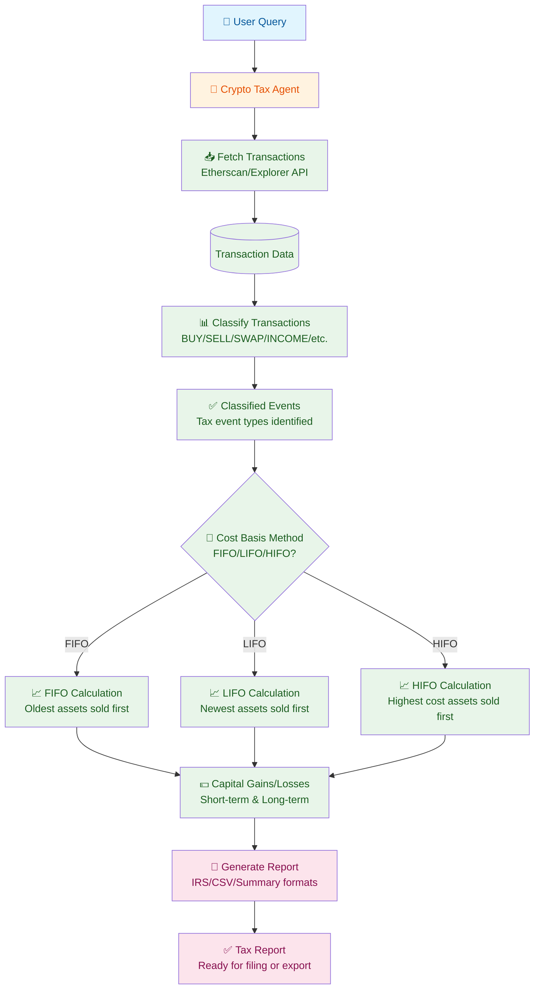

<div align="center">
  
  <br/>
  <h1>Crypto Tax Agent</h1>
  <b>Sample agent demonstrating on-chain transaction analysis and tax reporting with <code>@iqai/adk</code> library</b>
  <br/>
  <i>Multi-Chain • Tax Calculation • Cost Basis • TypeScript</i>
</div>

---

AI-powered crypto tax assistant built with ADK-TS that fetches on-chain transactions, classifies tax events, calculates cost basis using standard accounting methods (FIFO/LIFO/HIFO), and generates comprehensive tax reports.

## Features

- 🔗 **Multi-Chain Support**: Ethereum, Base, and Fraxtal blockchain support
- 📊 **Intelligent Transaction Classification**: Automatically categorizes transactions (BUY, SELL, SWAP, INCOME, etc.)
- 💰 **Cost Basis Calculation**: Supports FIFO, LIFO, and HIFO accounting methods
- 📄 **Tax Report Generation**: Creates reports in IRS Form 8949, CSV, and summary formats
- ⏰ **Time-Period Filtering**: Filter transactions by year or custom date ranges
- 🧠 **Natural Language Understanding**: Query transactions and reports conversationally
- 📈 **Built on ADK-TS**: Leverages IQAI Agent Development Kit for reliable AI interactions

## Architecture and Workflow

This project demonstrates a complete crypto tax analysis workflow with specialized tools:

1. **Crypto Tax Agent** - Main coordinator that orchestrates the tax analysis workflow
2. **Transaction Fetcher** - Retrieves on-chain transactions from blockchain explorers
3. **Transaction Classifier** - Categorizes transactions by tax event type
4. **Cost Basis Calculator** - Computes capital gains/losses using accounting methods
5. **Report Generator** - Creates tax reports in various formats

### Project Structure

```text
├── src/
│   ├── agents/
│   │   └── crypto-tax-agent/
│   │       └── agent.ts                  # Main orchestrator agent
│   ├── tools/
│   │   ├── fetchTransactions.ts          # Blockchain transaction fetching
│   │   ├── classifyTransaction.ts        # Tax event classification
│   │   ├── calculateCostBasis.ts         # Capital gains calculation
│   │   └── generateReport.ts             # Report generation
│   ├── services/
│   │   └── explorerService.ts            # Blockchain explorer integration
│   │   └── priceService.ts               # Price data integration
│   ├── types.ts                          # TypeScript type definitions
│   ├── env.ts                            # Environment configuration
│   └── index.ts                          # Main entry point
```

### Data Flow



## Getting Started

### Prerequisites

- [Node.js 18+](https://nodejs.org/)
- [Google AI API key](https://aistudio.google.com/api-keys) for LLM access
- [Etherscan API key](https://etherscan.io/apis) for blockchain data
- (Optional) [CoinGecko API key](https://www.coingecko.com/en/api) for price data

### Installation

1. Clone this repository

```bash
git clone https://github.com/IQAIcom/adk-ts-samples.git
cd adk-ts-samples/apps/crypto-tax-agent
```

2. Install dependencies

```bash
pnpm install
```

3. Get Your API Keys
   - **Google AI API Key**: Visit [Google AI Studio](https://aistudio.google.com/api-keys) and create an API key
   - **Etherscan API Key**: Create account at [Etherscan](https://etherscan.io/apis) for blockchain data access
   - **CoinGecko API Key**: (Optional) Get price data from [CoinGecko](https://www.coingecko.com/en/api)

4. Set up environment variables

```bash
cp .env.example .env
```

Edit `.env` with your configuration:

```env
GOOGLE_API_KEY=your_google_api_key_here
LLM_MODEL=gemini-2.5-flash
ETHERSCAN_API_KEY=your_etherscan_api_key_here
COINGECKO_API_KEY=your_coingecko_api_key_here
ADK_DEBUG=false
```

### Running the Agent

```bash
# Start the agent in development mode
pnpm dev

# Interactive testing with ADK CLI
adk run   # CLI chat interface
adk web   # Web interface
```

Once the agent is running, you can interact with it conversationally.

## Usage Examples

The agent handles complete crypto tax workflows through natural language queries. Here's a sample interaction:

```text
👤 User: Hi! I need to calculate my crypto taxes for 2024.
🤖 Agent: Hello! I can help you with crypto tax analysis. I support:
         • Multi-chain transaction fetching (Ethereum, Base, Fraxtal)
         • Tax event classification (buys, sells, swaps, income)
         • Cost basis calculation (FIFO, LIFO, HIFO methods)
         • Tax report generation

         What would you like to do?

👤 User: Fetch my transactions from wallet 0x742d35Cc6634C0532925a3b844Bc9e7595f0bEb on Ethereum for 2024
🤖 Agent: [Fetches transactions via Etherscan API]
         ✅ Found 47 transactions for 2024

👤 User: Now classify these transactions for tax purposes
🤖 Agent: [Classifies transactions]
         ✅ Classification complete:
         • 12 BUY transactions (cost basis events)
         • 8 SELL transactions (taxable events)
         • 15 SWAP transactions (capital gains)
         • 5 INCOME transactions (airdrops/staking)
         • 7 Other transactions

👤 User: Calculate capital gains using FIFO method
🤖 Agent: [Calculates gains]
         ✅ Capital Gains Summary (FIFO):
         • Short-term gains: $2,450.32
         • Long-term gains: $8,120.65
         • Losses: ($1,230.15)
         • Net gains: $9,340.82

👤 User: Generate an IRS Form 8949 report
🤖 Agent: [Generates report]
         ✅ Report generated and ready for download
```

**Example Queries:**

- "Fetch my transactions from wallet 0x742d35Cc6634C0532925a3b844Bc9e7595f0bEb on Ethereum for 2024"
- "Classify my transactions for tax purposes"
- "Calculate capital gains using LIFO method"
- "Generate a detailed tax report with Form 8949 format"
- "Generate a summary report showing totals"
- "Export results as CSV"
- "What's my total capital gains for 2024?"

## Tax Methods Explained

### FIFO (First In, First Out)

- **Description**: Assumes oldest assets are sold first
- **Use Case**: Most common method, easier to track
- **Result**: Higher capital gains in bull markets

### LIFO (Last In, First Out)

- **Description**: Assumes newest assets are sold first
- **Use Case**: Can reduce taxes if recent purchases were expensive
- **Result**: Lower gains if recent purchases were at higher prices

### HIFO (Highest In, First Out)

- **Description**: Matches sales with highest-cost acquisitions first
- **Use Case**: Tax optimization strategy
- **Result**: Minimizes capital gains

## Capital Gains Classification

### Short-Term Capital Gains

- Assets held ≤ 365 days
- Taxed as ordinary income
- Rates vary by income level (10-37%)

### Long-Term Capital Gains

- Assets held > 365 days
- Preferential tax rates (0%, 15%, or 20%)
- More favorable than short-term

### Income Events

- Staking rewards, airdrops, mining rewards
- Taxed as ordinary income at fair market value received
- Creates cost basis for future disposals

## Agent Tools and Capabilities

| Tool                    | Purpose                                                               |
| ----------------------- | --------------------------------------------------------------------- |
| `fetch_transactions`    | Retrieve on-chain transactions from blockchain explorers              |
| `classify_transactions` | Categorize transactions into tax event types and determine taxability |
| `calculate_cost_basis`  | Calculate capital gains/losses using FIFO, LIFO, or HIFO methods      |
| `generate_report`       | Create tax reports in Form 8949, CSV, or summary format               |

## Known Limitations

This is a **sample implementation** designed for educational purposes. Known limitations:

- ⚠️ **Basic Transaction Classification**: Uses simple heuristics (from/to address matching) - doesn't detect DEX swaps, smart contract interactions, or complex DeFi transactions
- ⚠️ **Price Data**: Uses CoinGecko API when available, falls back to mock prices
- ⚠️ **No Persistence**: Session-based only, no database storage for multi-session state
- ⚠️ **EVM Chains Only**: Ethereum, Base, Fraxtal - no Bitcoin, Solana, or other blockchains
- ⚠️ **No Advanced Tax Features**:
  - No wash sale rule detection
  - No DeFi protocol tracking (lending, liquidity pools)
  - No NFT or smart contract interaction detection
  - No margin trading or derivatives
  - Limited to individual address analysis (no multi-wallet aggregation)
  - No cost allocation for partial fills

## Areas for Improvement

- Real-time price data integration
- Enhanced DeFi protocol support
- Multi-wallet portfolio tracking
- Tax optimization suggestions
- Export formats for popular tax software (TurboTax, TaxAct, etc.)

## Troubleshooting

### Common Issues

- **Etherscan API errors**: Ensure ETHERSCAN_API_KEY is valid and has not exceeded rate limits
- **Missing price data**: CoinGecko API may have rate limits; falls back to mock prices
- **Transaction classification errors**: Complex DeFi transactions may be classified as UNKNOWN
- **Google AI errors**: Ensure GOOGLE_API_KEY is valid and has sufficient quota
- **Empty transaction lists**: Verify wallet address format and chain selection

## Useful Resources

### ADK-TS Framework

- [ADK-TS Documentation](https://adk.iqai.com/)
- [ADK-TS CLI Documentation](https://adk.iqai.com/docs/cli)
- [ADK-TS Samples Repository](https://github.com/IQAIcom/adk-ts-samples)
- [ADK-TS GitHub Repository](https://github.com/IQAICOM/adk-ts)

### APIs & Services

- [Google AI Studio](https://aistudio.google.com/) (for API keys)
- [Etherscan API](https://etherscan.io/apis) (blockchain data)
- [CoinGecko API](https://www.coingecko.com/en/api) (price data)
- [Etherscan Documentation](https://docs.etherscan.io/)

### Tax Resources

- [IRS Form 8949](https://www.irs.gov/forms-pubs/about-form-8949) (About Form 8949)

### Community

- [ADK-TS Discussions](https://github.com/IQAIcom/adk-ts/discussions)

## Contributing

This Crypto Tax Agent is part of the [ADK-TS Samples](https://github.com/IQAIcom/adk-ts-samples) repository, a collection of sample projects demonstrating ADK-TS capabilities.

We welcome contributions to the ADK-TS Samples repository! You can:

- **Add new sample projects** showcasing different ADK-TS features
- **Improve existing samples** with better documentation, new features, or optimizations
- **Fix bugs** in current implementations
- **Update dependencies** and keep samples current

Please see our [Contributing Guide](../../CONTRIBUTION.md) for detailed guidelines.

## License

This project is licensed under the MIT License - see the [LICENSE](../../LICENSE) file for details.

## Disclaimer

This agent is for educational purposes only. **Not financial or tax advice.** Always consult with a qualified tax professional or CPA before filing crypto taxes. Tax laws vary by jurisdiction and individual circumstances. Use at your own risk.

---

**💰 Ready to manage your crypto taxes?** This sample demonstrates on-chain transaction analysis, tax event classification, and report generation using ADK-TS.
