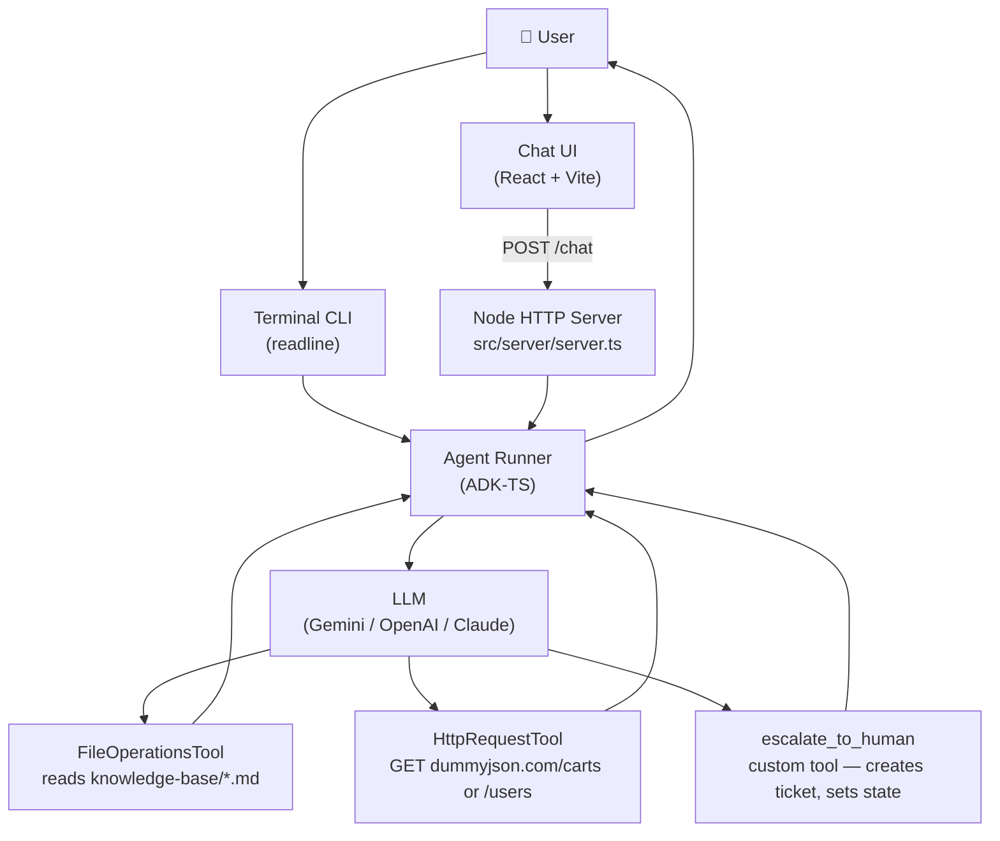

<div align="center">
  
  <br/>
  <h1>Customer Support Agent</h1>
  <b>A single-agent customer support chatbot with built-in tools, custom tool, and session state, built on the <code>ADK-TS</code> framework.</b>
  <br/>
  <i>Single-Agent • Built-in Tools • Custom Tool • Session State • React • Vite • TypeScript</i>
</div>

---

An AI-powered customer support agent for Acme Corp built with a single **LlmAgent** in ADK-TS. It answers policy questions from local markdown files, fetches live order and account data via HTTP, and escalates unresolvable issues to a human agent via a custom tool — all with session state tracking the escalation status. Runs as both a React web chat UI and an interactive terminal CLI.

## Features

- **Policy Q&A**: Reads shipping, return, payment, and membership policies from local markdown files using the built-in `FileOperationsTool`
- **Live order lookup**: Fetches real-time cart/order data by order number using the built-in `HttpRequestTool`
- **Account lookup**: Retrieves user account details by user ID via the same `HttpRequestTool`
- **Human escalation**: Custom `escalate_to_human` tool creates a timestamped ticket ID, sets session state, and flags the conversation for follow-up
- **Session state**: Tracks escalation status across the full conversation using ADK-TS state — the agent knows not to re-escalate
- **Two run modes**: Web chat UI (React + Vite) or interactive terminal CLI (readline) — same agent, two interfaces
- **Multi-model support**: Swap between Gemini, OpenAI, or Anthropic Claude with a single env var change

## Architecture and Workflow

This project demonstrates the **single LlmAgent with built-in tools, a custom tool, and session state** pattern in ADK-TS — one agent equipped with two built-in tools, one hand-rolled tool, and shared state that persists across turns.

### How It Works

| Piece                      | Role                                                                                  |
| -------------------------- | ------------------------------------------------------------------------------------- |
| **LlmAgent**               | Handles all user messages and decides which tool to call                              |
| **FileOperationsTool**     | Lists and reads markdown files from `src/server/knowledge-base/` to answer policy Q&A |
| **HttpRequestTool**        | Makes outbound GET requests to fetch live order and account data                      |
| **escalate_to_human tool** | Custom tool: creates a ticket ID, sets `escalated` state, logs a support ticket       |
| **Node HTTP Server**       | Exposes a `/chat` POST endpoint for the React UI                                      |
| **Vite Dev Server**        | Serves the React chat UI and proxies `/chat` to the Node server                       |

### Data Flow



### Project Structure

```text
src/
├── server/
│   ├── agents/
│   │   ├── agent.ts               # LlmAgent builder with tools and session state
│   │   └── tools.ts               # FileOperationsTool, HttpRequestTool, escalate_to_human
│   ├── knowledge-base/
│   │   ├── faq.md                 # General FAQs
│   │   ├── refund-policy.md       # Return and refund policy
│   │   └── shipping-info.md       # Shipping rates and timelines
│   ├── index.ts                   # CLI entry point (readline loop)
│   └── server.ts                  # HTTP server entry point (POST /chat)
├── App.tsx                        # React chat UI
├── App.css                        # Chat UI styles
└── main.tsx                       # React entry point
index.html
vite.config.ts                     # Vite config with /chat proxy to localhost:3001
```

## Getting Started

### Prerequisites

- **Node.js 22+** — [Download Node.js](https://nodejs.org/en/download/)
- **An API key** for your chosen model provider:
  - [Google AI Studio](https://aistudio.google.com/app/api-keys) (default — Gemini)
  - [OpenAI](https://platform.openai.com/api-keys)
  - [Anthropic](https://console.anthropic.com/)

### Installation

1. Clone this repository

```bash
git clone https://github.com/IQAIcom/adk-ts-samples.git
cd adk-ts-samples/apps/customer-support-agent
```

2. Install dependencies

```bash
pnpm install
```

3. Set up environment variables

```bash
cp .env.example .env
```

Edit `.env` and add your API key:

```env
GOOGLE_API_KEY=your_google_api_key_here
LLM_MODEL=gemini-2.5-flash
```

To use a different provider, swap the key and model:

```env
# OpenAI
OPENAI_API_KEY=your_openai_api_key_here
LLM_MODEL=gpt-4o

# Anthropic
ANTHROPIC_API_KEY=your_anthropic_api_key_here
LLM_MODEL=claude-sonnet-4-6
```

### Running the Agent

**Web chat UI** (server + frontend together):

```bash
pnpm dev
```

Open [http://localhost:5173](http://localhost:5173).

**Terminal CLI** (no UI, just the agent in your terminal):

```bash
pnpm dev:cli
```

## Usage

**Web UI** (`pnpm dev`) — type a message into the chat box and press Send. Use the example prompt buttons on first load to try common support scenarios.

**CLI** (`pnpm dev:cli`) — type your question at the `You:` prompt and press Enter. Type `exit` to quit.

```text
You: What is your return policy?
Agent: Based on our refund policy, you can return most items within 30 days of
       delivery for a full refund...

You: Where is my order? My order number is 3
Agent: I checked your order and found the following items in cart #3: ...

You: Look up my account, my user ID is 1
Agent: I found your account: Terry Medhurst, terry.medhurst@example.com ...

You: I need to speak to a human agent
Agent: I've created a support ticket (TKT-ABC123) and a human agent will follow
       up within 2 business hours. You'll receive an email confirmation shortly.
```

## Real-World Use Cases

The **read policy → fetch live data → escalate** pattern in this project maps directly to real production support workflows. Here are examples of what you can build by extending this agent:

### E-Commerce Support Bot

Replace `dummyjson.com` with your own order management API and swap the markdown files for a headless CMS (Contentful, Sanity). The escalation tool opens a Zendesk or Freshdesk ticket via their REST APIs instead of logging to console.

### SaaS Help Desk Agent

Point `FileOperationsTool` at your docs folder or pipe in content from Notion or Confluence. Wire `HttpRequestTool` to your internal billing and subscription APIs to answer account-tier and usage questions without a human in the loop.

### Internal IT Support Agent

Replace the knowledge-base with IT runbooks and FAQs, and the HTTP tool with ServiceNow or Jira APIs. The escalation tool creates a proper IT ticket with the conversation transcript attached.

### How to Adapt This Agent

| Component              | What to Customize                                        | Example                                                      |
| ---------------------- | -------------------------------------------------------- | ------------------------------------------------------------ |
| **FileOperationsTool** | Swap markdown files for a CMS, vector store, or database | Replace with Pinecone semantic search for large policy bases |
| **HttpRequestTool**    | Call your own authenticated APIs instead of the mock     | Add auth headers and call your real order management system  |
| **escalate_to_human**  | Open a real ticket in your helpdesk instead of logging   | POST to Zendesk, Intercom, or Freshdesk with the transcript  |
| **Session state**      | Add more state fields for your workflow (e.g. order ID)  | Track `current_order_id` so the agent doesn't ask twice      |

## Useful Resources

### ADK-TS Framework

- [ADK-TS Documentation](https://adk.iqai.com/)
- [ADK-TS CLI Documentation](https://adk.iqai.com/docs/cli)
- [Built-in Tools Reference](https://adk.iqai.com/docs/framework/tools/built-in-tools)
- [ADK-TS Samples Repository](https://github.com/IQAIcom/adk-ts-samples)
- [ADK-TS GitHub Repository](https://github.com/IQAICOM/adk-ts)

### APIs & Services

- [Google AI Studio Keys](https://aistudio.google.com/app/api-keys)
- [OpenAI API Keys](https://platform.openai.com/api-keys)
- [Anthropic API Keys](https://console.anthropic.com/)

### Community

- [ADK-TS Discussions](https://github.com/IQAIcom/adk-ts/discussions)
- [ADK-TS Builders Community](https://t.me/+Z37x8uf6DLE3ZTQ8)
- [IQ AI Community](https://t.me/IQAICOM)

## Contributing

This Customer Support Agent is part of the [ADK-TS Samples](https://github.com/IQAIcom/adk-ts-samples) repository, a collection of example projects demonstrating ADK-TS capabilities.

We welcome contributions to the ADK-TS Samples repository! You can:

- **Add new sample projects** showcasing different ADK-TS features
- **Improve existing samples** with better documentation, new features, or optimizations
- **Fix bugs** in current implementations
- **Update dependencies** and keep samples current

Please see our [Contributing Guide](../../CONTRIBUTION.md) for detailed guidelines.

## License

This project is licensed under the MIT License - see the [LICENSE](../../LICENSE) file for details.

---

**🎉 Ready to build your own support agent?** This project showcases how a single LlmAgent with two built-in tools, one custom tool, and a pinch of session state can handle the most common support flows — no complex orchestration needed.
