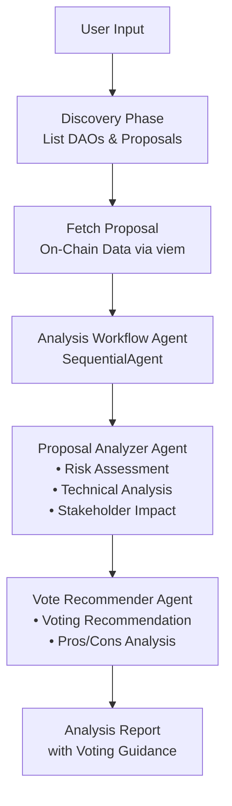

<div align="center">
  
  <br/>
  <h1>DAO Proposal Analyzer</h1>
  <b>Multi-agent governance system that analyzes on-chain DAO proposals and provides voting recommendations using <code>@iqai/adk</code>.</b>
  <br/>
  <i>On-Chain Data • Multi-Agent Analysis • Voting Recommendations</i>
</div>

---

An AI-powered DAO governance assistant that fetches real on-chain proposal data from DAOs on Ethereum mainnet (Compound, Uniswap, ENS, Aave), performs deep analysis, and provides informed voting recommendations. Built with a multi-agent architecture for comprehensive governance analysis.

## Features

- **On-Chain Data Fetching**: Fetches real governance data directly from Ethereum using [viem](https://viem.sh/)
- **Ethereum Mainnet Support**: Analyzes proposals from Compound, Uniswap, ENS, and Aave
- **Deep Proposal Analysis**: Examines technical details, risks, and stakeholder impacts
- **Vote Recommendations**: Provides balanced recommendations with pros/cons analysis
- **Sequential Workflow**: Agents work in sequence, each building on previous insights

## Architecture and Workflow

This project demonstrates multi-agent orchestration with sequential processing for governance analysis:

1. **Root Agent** (`dao_proposal_analyzer`) - Handles user interaction and fetches on-chain data
2. **Analysis Workflow Agent** (`analysis_workflow_agent`) - SequentialAgent coordinating the analysis pipeline
3. **Proposal Analyzer Agent** (`proposal_analyzer_agent`) - Deep analysis of proposal details and risks
4. **Vote Recommender Agent** (`vote_recommender_agent`) - Synthesizes analysis into voting guidance

### Project Structure

```text
├── src/
│   ├── agents/
│   │   ├── agent.ts                           # Root orchestrator agent
│   │   ├── analysis-workflow-agent/
│   │   │   └── agent.ts                       # Sequential workflow coordinator
│   │   ├── proposal-analyzer-agent/
│   │   │   └── agent.ts                       # Proposal analysis specialist
│   │   └── vote-recommender-agent/
│   │       └── agent.ts                       # Vote recommendation specialist
│   ├── tools/
│   │   └── fetchProposalTool.ts               # On-chain data fetching tools
│   ├── services/
│   │   └── governanceService.ts               # viem-based service for on-chain governance data
│   ├── constants.ts                           # DAO addresses and configuration
│   ├── types.ts                               # TypeScript type definitions
│   ├── env.ts                                 # Environment configuration
│   └── index.ts                               # Main execution entry
```

### Data Flow



## Getting Started

### Prerequisites

- Node.js 18+
- LLM API key (OpenAI, Google, or other supported providers)
- Ethereum RPC URL (Alchemy, Infura, or public RPC)

### Installation

1. Clone this repository

```bash
git clone https://github.com/IQAIcom/adk-ts-samples.git
cd adk-ts-samples/apps/dao-proposal-analyzer
```

2. Install dependencies

```bash
pnpm install
```

3. Set up environment variables

```bash
cp .env.example .env
```

Edit `.env` and add your API keys:

```env
OPENAI_API_KEY=your_openai_api_key_here
LLM_MODEL=gpt-4o-mini
ETHEREUM_RPC_URL=https://eth-mainnet.g.alchemy.com/v2/your-api-key
```

### Running the Analyzer

```bash
# Run the demo script
pnpm dev

# Interactive testing with ADK CLI
adk run   # CLI chat interface
adk web   # Web interface
```

## Supported DAOs (Ethereum Mainnet)

| DAO      | Governor Contract                            | Token |
| -------- | -------------------------------------------- | ----- |
| Compound | `0xc0Da02939E1441F497fd74F78cE7Decb17B66529` | COMP  |
| Uniswap  | `0x408ED6354d4973f66138C91495F2f2FCbd8724C3` | UNI   |
| ENS      | `0x323A76393544d5ecca80cd6ef2A560C6a395b7E3` | ENS   |
| Aave     | `0x9AEE0B04504CeF83A65AC3f0e838D0593BCb2BC7` | AAVE  |

## Usage Examples

```text
User: What DAOs do you support?
Agent: I support DAOs on Ethereum mainnet: Compound, Uniswap, ENS, and Aave...

User: Show me recent Compound proposals
Agent: Here are the latest Compound proposals...
  - #289: Protocol Upgrade (Active)
  - #288: Parameter Change (Executed)
  ...

User: Analyze proposal 289 from Compound
Agent: [Fetches on-chain data, then provides:]
  - Executive Summary
  - Risk Assessment
  - Stakeholder Impact
  - Voting Recommendation with pros/cons
```

## Useful Resources

### ADK-TS Framework

- [ADK-TS Documentation](https://adk.iqai.com/)
- [ADK-TS CLI Documentation](https://adk.iqai.com/docs/cli)
- [ADK-TS Samples Repository](https://github.com/IQAIcom/adk-ts-samples)
- [ADK-TS GitHub Repository](https://github.com/IQAICOM/adk-ts)

### DAO Governance

- [Compound Governance](https://compound.finance/governance)
- [Uniswap Governance](https://gov.uniswap.org/)
- [ENS Governance](https://docs.ens.domains/dao)
- [Aave Governance](https://governance.aave.com/)

### APIs & Services

- [OpenAI API Keys](https://platform.openai.com/api-keys)
- [Alchemy RPC](https://www.alchemy.com/)
- [Infura RPC](https://infura.io/)

### Community

- [ADK-TS Discussions](https://github.com/IQAIcom/adk-ts/discussions)
- [Discord Community](https://discord.gg/w2Uk6ACK4D)

## Disclaimer

This tool provides AI-generated analysis for informational purposes only. It does NOT constitute financial or investment advice. Always:

- Do your own research (DYOR)
- Read the full proposal text and discussions
- Consider your individual circumstances
- Consult financial advisors for significant decisions

## Contributing

This DAO Proposal Analyzer is part of the [ADK-TS Samples](https://github.com/IQAIcom/adk-ts-samples) repository.

Please see our [Contributing Guide](../../CONTRIBUTION.md) for detailed guidelines.

## License

This project is licensed under the MIT License - see the [LICENSE](../../LICENSE) file for details.

---

**Ready to analyze DAO proposals?** This project showcases multi-agent orchestration for governance analysis using ADK-TS with real on-chain data integration.
