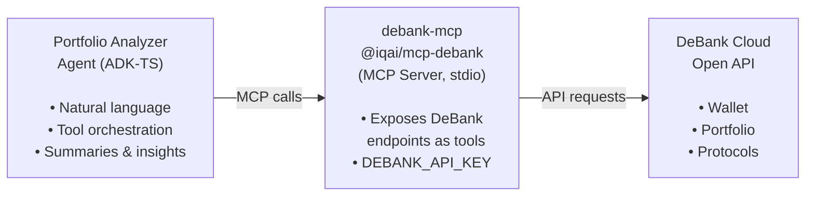

<div align="center">
  
  <br/>
  <h1>DeBank Portfolio Analyzer</h1>
  <b>Sample agent that showcases <strong>debank-mcp</strong> — integrate DeBank wallet, portfolio, and DeFi data into your AI agents with the <code>ADK-TS</code> framework.</b>
  <br/>
  <i>DeBank MCP • Portfolio Analysis • Multi-Chain • DeFi Data</i>
</div>

---

This sample exists to **raise awareness and drive adoption of [debank-mcp](https://www.npmjs.com/package/@iqai/mcp-debank)**. It demonstrates a complete, production-style integration of the DeBank MCP server with ADK-TS: an AI-powered portfolio analyzer that uses DeBank’s APIs for wallet balances, token holdings, protocol positions, NFTs, and activity history.

**Built with [ADK-TS](https://adk.iqai.com/) and [@iqai/mcp-debank](https://www.npmjs.com/package/@iqai/mcp-debank)**

---

## Why debank-mcp?

**[debank-mcp](https://www.npmjs.com/package/@iqai/mcp-debank)** is an MCP (Model Context Protocol) server that exposes [DeBank Cloud](https://docs.cloud.debank.com/) APIs as tools. Use it to:

- **Add DeBank data to any MCP-compatible agent** — no custom API glue code.
- **Query multi-chain portfolios** — total balance, token list, protocol positions, NFTs, and activity.
- **Keep integrations simple** — run via `npx @iqai/mcp-debank` with a DeBank API key; ADK-TS `McpToolset` wires tools automatically.

This sample is the **reference implementation** for using debank-mcp inside an ADK-TS agent. Fork it, adapt it, or use it as a template to bring DeBank-powered portfolio analysis into your own agents.

---

## What this sample shows

- **debank-mcp integration**: Configuring and using `McpToolset` with the DeBank MCP server (`stdio` transport, `npx`).
- **Portfolio analyzer agent**: A single agent that fetches and explains portfolio data via DeBank tools.
- **End-to-end flow**: From user questions → tool calls → DeBank API → clear, summarized answers.

---

## Features

- **Multi-chain portfolio data**: Balances, tokens, and protocol positions across supported chains.
- **DeFi & NFT visibility**: Protocol positions and NFT holdings via DeBank.
- **Natural-language interface**: Ask for balances, distributions, exposures, and activity in plain language.
- **MCP-first design**: All DeBank access goes through debank-mcp; no direct REST integration in the agent.

---

## Architecture and Workflow

This project demonstrates MCP-powered portfolio analysis using debank-mcp as the data layer:

1. **Portfolio Analyzer Agent** (`portfolio_analyzer`) - Main conversational agent that interprets user queries and orchestrates tool calls
2. **debank-mcp** (`@iqai/mcp-debank`) - MCP server exposing DeBank Cloud APIs as tools via stdio transport
3. **DeBank Cloud API** - Upstream data source for wallet balances, token holdings, protocol positions, and NFTs

### Project Structure

```text
src/
├── agents/
│   └── portfolio-analyzer-agent/
│       ├── agent.ts          # Agent definition, system prompt, tool wiring
│       └── tools.ts          # debank-mcp config & McpToolset setup
├── env.ts                    # Environment validation (GOOGLE_API_KEY, DEBANK_API_KEY)
└── index.ts                  # Demo runner: greet, balance, protocols, NFTs, summary
```

### Data Flow



---

## Getting Started

### Prerequisites

- Node.js 18+
- pnpm (or npm/yarn)
- [Google AI API key](https://aistudio.google.com/api-keys) (for the LLM)
- [DeBank Cloud API key](https://docs.cloud.debank.com/en/readme/open-api) (for debank-mcp)

### Installation

1. **Clone and enter the app**

   ```bash
   git clone https://github.com/IQAIcom/adk-ts-samples.git
   cd adk-ts-samples/apps/debank-portfolio-analyzer
   ```

2. **Install dependencies**

   ```bash
   pnpm install
   ```

3. **Get API keys**
   - **Google AI**: [Google AI Studio](https://aistudio.google.com/api-keys) → Create API key.
   - **DeBank**: Register at [DeBank](https://debank.com/) and use [DeBank Cloud Open API](https://docs.cloud.debank.com/en/readme/open-api) to obtain your access key.

4. **Configure environment**

   ```bash
   cp .env.example .env
   ```

   Edit `.env`:

   ```env
   ADK_DEBUG=false
   GOOGLE_API_KEY=your_google_api_key_here
   DEBANK_API_KEY=your_debank_api_key_here
   LLM_MODEL=gemini-2.5-flash
   ```

   `DEBANK_API_KEY` is required for debank-mcp. The MCP server is started with this env var when the agent runs.

### Run the agent

**Demo script (default)**

```bash
pnpm dev
```

Runs the built-in demo: greeting, total balance, protocol positions, NFTs, and a portfolio summary for a sample wallet.

**Interactive testing**

```bash
adk run   # CLI chat
adk web   # Web UI
```

Use your own wallet address and questions when testing.

---

## Usage Examples

The agent uses debank-mcp tools to answer portfolio questions. Example flow:

```text
👤 User: Hi! Can you help me analyze my crypto portfolio?
🤖 Agent: [Greeting, explains capabilities, asks for wallet address or other inputs]

👤 User: My wallet address is 0x1dfC530A9B3955d62D16359110E3cf385d47b1a9. What's my total balance across all chains?
🤖 Agent: [Calls DeBank tools via debank-mcp, returns total balance summary]

👤 User: Can you show me my DeFi protocol positions?
🤖 Agent: [Lists protocol positions from DeBank]

👤 User: What NFTs do I have in this wallet?
🤖 Agent: [Returns NFT holdings]

👤 User: Give me a summary of my portfolio distribution and any high-risk exposures you see.
🤖 Agent: [Summarizes distribution and highlights risks based on retrieved data]
```

---

## Real-World Use Cases

The **MCP-powered portfolio analysis** pattern in this project applies to any workflow that needs on-chain wallet data. Here are examples of what you can build by extending this analyzer:

### Whale Wallet Tracker

Monitor high-value wallets for portfolio changes. The agent periodically fetches balances and protocol positions, detects significant moves (large token transfers, new protocol entries), and alerts users to whale activity.

### DeFi Risk Monitor

Focus the agent on risk analysis. It fetches protocol positions across chains, evaluates exposure concentration, flags high-risk protocols or illiquid positions, and produces a risk dashboard with actionable alerts.

### Portfolio Rebalancing Advisor

Extend the agent to compare current holdings against a target allocation. It fetches live portfolio data, calculates drift from target weights, and recommends specific trades to rebalance — all through natural language.

### How to Adapt This Pattern

The core architecture generalizes to any DeBank-powered agent:

| Component              | What to Customize                                  | Example                                                         |
| ---------------------- | -------------------------------------------------- | --------------------------------------------------------------- |
| **MCP Tools**          | Filter or extend which DeBank tools the agent uses | Focus only on protocol positions for a DeFi-specific agent      |
| **Agent Instructions** | Adjust the system prompt for your analysis focus   | Add risk scoring criteria for a risk monitoring agent           |
| **Output Format**      | Change how the agent presents results              | Generate structured JSON for a dashboard instead of text        |
| **Data Sources**       | Combine debank-mcp with other MCP servers          | Add price feed MCP for real-time token pricing alongside DeBank |

You can also **chain agents** — use this analyzer as the first step in a SequentialAgent pipeline that feeds portfolio data into a tax calculator or rebalancing optimizer.

---

## debank-mcp in this project

Integration lives in `src/agents/portfolio-analyzer-agent/tools.ts`:

- **MCP server**: `@iqai/mcp-debank`, run via `npx -y @iqai/mcp-debank` with `stdio` transport.
- **Config**: `McpConfig` plus `McpToolset`; `DEBANK_API_KEY` passed in `env` to the MCP process.
- **Tools**: All DeBank-backed tools come from `debankMcpToolset.getTools()` and are passed into the agent.

To **reuse debank-mcp in your own agent**: copy the `tools.ts` pattern, ensure `DEBANK_API_KEY` is set, and attach the fetched tools to your ADK-TS agent.

---

## Useful Resources

### debank-mcp & DeBank

- [@iqai/mcp-debank on npm](https://www.npmjs.com/package/@iqai/mcp-debank)
- [DeBank Cloud Open API](https://docs.cloud.debank.com/en/readme/open-api)
- [DeBank API Reference](https://docs.cloud.debank.com/en/readme/api-pro-reference)

### ADK-TS

- [ADK-TS Documentation](https://adk.iqai.com/)
- [ADK-TS CLI](https://adk.iqai.com/docs/cli)
- [ADK-TS Samples](https://github.com/IQAIcom/adk-ts-samples)
- [ADK-TS GitHub](https://github.com/IQAIcom/adk-ts)

### Community

- [ADK-TS Discussions](https://github.com/IQAIcom/adk-ts/discussions)
- [ADK-TS Builders Community](https://t.me/+Z37x8uf6DLE3ZTQ8)
- [IQ AI Community](https://t.me/IQAICOM)

---

## Contributing

This sample is part of [ADK-TS Samples](https://github.com/IQAIcom/adk-ts-samples). Contributions that improve debank-mcp adoption or this reference integration are welcome. See the [Contributing Guide](../../CONTRIBUTION.md) for guidelines.

## License

This project is licensed under the MIT License - see the [LICENSE](../../LICENSE) file for details.

---

## Disclaimer

This tool is for **education and reference** only. It does not provide financial, investment, or tax advice. Use DeBank data and any portfolio insights at your own risk. Always do your own research and consult qualified professionals for financial decisions.

---

**Ready to build agents with DeBank data?** Use **debank-mcp** and this sample to add portfolio-aware, multi-chain DeFi capabilities to your AI agents.
