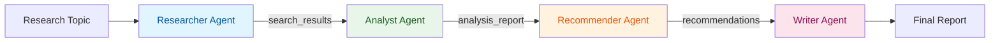

<div align="center">
  
  <br/>
  <h1>Research Assistant</h1>
  <b>A sequential agent pipeline for web research using the <code>ADK-TS</code> framework.</b>
  <br/>
  <i>Sequential Pipeline • State-Driven • Extensible • TypeScript</i>
</div>

---

An AI-powered research assistant built as a **SequentialAgent** pipeline. Give it any topic and it runs 4 agents in sequence — researcher, analyst, recommender, and writer — each building on the previous agent's output through shared state. The final result is a comprehensive research report with analysis, recommendations, and full source citations.

## Features

- **Sequential Pipeline**: Uses ADK-TS `SequentialAgent` to enforce a strict 4-step execution order
- **State-Driven Data Flow**: Each agent reads from and writes to shared state — no prompt engineering for workflow control
- **Single Responsibility**: Each agent has one clear job (research, analyze, recommend, write)
- **Before/After Callbacks**: Pipeline progress logging with execution timing on each agent step
- **Session State Initialization**: Pre-configured `app:` prefixed state for app-level settings
- **Memory Service**: Stores completed research sessions for cross-session recall and search
- **Web Research**: Tavily API integration for high-quality web search with content extraction
- **Composable Architecture**: Easy to add, remove, or swap pipeline steps
- **Topic Agnostic**: Works with any research topic across all domains

## Architecture

This project demonstrates the **SequentialAgent** pattern in ADK-TS — a pipeline where agents execute one after another, each building on the previous agent's output through shared state.

### Pipeline Steps

| Step | Agent           | Input (from state)                   | Output (to state) | Job                                     |
| ---- | --------------- | ------------------------------------ | ----------------- | --------------------------------------- |
| 1    | **Researcher**  | User's topic                         | `search_results`  | Web search via Tavily (3 searches)      |
| 2    | **Analyst**     | `search_results`                     | `analysis_report` | Extract insights, patterns, statistics  |
| 3    | **Recommender** | `search_results` + `analysis_report` | `recommendations` | Prioritized, actionable recommendations |
| 4    | **Writer**      | All 3 prior outputs                  | `final_report`    | Synthesized comprehensive report        |

### Data Flow



### Project Structure

```text
src/
├── agents/
│   ├── agent.ts                        # Root SequentialAgent (orchestrator)
│   ├── researcher-agent/
│   │   └── agent.ts                    # Step 1: Web research with Tavily
│   ├── analysis-report-agent/
│   │   └── agent.ts                    # Step 2: Analysis and insights
│   ├── recommender-agent/
│   │   └── agent.ts                    # Step 3: Actionable recommendations
│   ├── writer-agent/
│   │   └── agent.ts                    # Step 4: Final report synthesis
│   └── tools/
│       └── TavilySearchTool.ts         # Web search with state management
├── callbacks.ts                        # Before/after agent callbacks
├── constants.ts                        # State key definitions
├── env.ts                              # Environment configuration
└── index.ts                            # Entry point
```

## Framework Features Demonstrated

Beyond the sequential pipeline, this project showcases several ADK-TS framework features that are useful in production applications.

### Before/After Agent Callbacks

Each sub-agent is configured with `beforeAgentCallback` and `afterAgentCallback` to log pipeline progress with execution timing. Callbacks receive a `CallbackContext` providing access to the agent name, session state, and invocation metadata.

```typescript
// callbacks.ts
import type { CallbackContext } from "@iqai/adk";

export const beforeAgentCallback = async (ctx: CallbackContext) => {
	console.log(`>> ${ctx.agentName} - Starting...`);
	ctx.state[`temp:${ctx.agentName}_start`] = Date.now(); // temp: prefix = not persisted
	return undefined; // Continue normal execution
};

// Applied to each sub-agent:
new LlmAgent({
	name: "analyst_agent",
	beforeAgentCallback,
	afterAgentCallback,
	// ...
});
```

### Session State Initialization

The session is initialized with `app:` prefixed state values for app-level configuration. ADK-TS supports three state prefixes:

- `app:` — Shared across all users and sessions (app-wide config)
- `user:` — Shared across sessions for a specific user (user preferences)
- `temp:` — Not persisted (temporary data like callback timestamps)
- No prefix — Session-scoped (the default, used by pipeline state keys)

```typescript
AgentBuilder.create("research_assistant")
	.asSequential([...agents])
	.withQuickSession({
		appName: "research_assistant",
		userId: "user",
		state: {
			"app:max_searches": 3,
			"app:pipeline_steps": ["researcher", "analyst", "recommender", "writer"],
		},
	})
	.build();
```

### Memory Service

After the pipeline completes, the research session is saved to memory using `InMemoryMemoryService`. This enables searching and recalling past research across sessions — useful for building knowledge bases or avoiding duplicate research.

```typescript
import { InMemoryMemoryService } from "@iqai/adk";

const memoryService = new InMemoryMemoryService();

// After pipeline completes:
await memoryService.addSessionToMemory(session);

// Later, search past research:
const results = await memoryService.searchMemory({
	appName: "research_assistant",
	userId: "user",
	query: "artificial intelligence healthcare",
});
```

For production, swap `InMemoryMemoryService` with a persistent implementation backed by a database or vector store.

### How State Flows Through the Pipeline

```text
Initial State (pre-configured):
  app:max_searches: 3
  app:pipeline_steps: ["researcher", "analyst", "recommender", "writer"]

After Step 1 (Researcher):
  search_results: [{ query, results, timestamp }, { ... }, { ... }]  // 3 search rounds

After Step 2 (Analyst):
  search_results: [...]          // unchanged
  analysis_report: "=== RESEARCH ANALYSIS === ..."                   // ~1000 words

After Step 3 (Recommender):
  search_results: [...]          // unchanged
  analysis_report: "..."         // unchanged
  recommendations: "=== RECOMMENDATIONS === ..."                     // ~800 words

After Step 4 (Writer):
  search_results: [...]          // unchanged
  analysis_report: "..."         // unchanged
  recommendations: "..."         // unchanged
  final_report: "=== FINAL RESEARCH REPORT === ..."                  // ~2500 words
```

## Getting Started

### Prerequisites

- Node.js 18+
- LLM API key (OpenAI, Google, or other supported providers)
- Tavily API key for web search

### Installation

1. Clone this repository

```bash
git clone https://github.com/IQAIcom/adk-ts-samples.git
cd adk-ts-samples/apps/research-assistant
```

1. Install dependencies

```bash
pnpm install
```

1. Set up environment variables

```bash
cp .env.example .env
```

Edit `.env` and add your API keys:

```env
OPENAI_API_KEY=your_openai_api_key_here
LLM_MODEL=your_preferred_model_here
TAVILY_API_KEY=your_tavily_api_key_here
```

### Running the Assistant

```bash
# Run the demo script
pnpm dev

# Interactive testing with ADK CLI
adk run   # CLI chat interface
adk web   # Web interface
```

## Usage

Give the agent any research topic and it will run the full pipeline automatically:

```text
Session state (app-level config):
  app:max_searches   = 3
  app:pipeline_steps = ["researcher","analyst","recommender","writer"]

Research topic: "Impact of artificial intelligence on healthcare in 2025"

Starting sequential pipeline...
(Before/after callbacks will log each step)

>> Step 1/4: Researcher - Starting...
<< Step 1/4: Researcher - Complete (12.3s)

>> Step 2/4: Analyst - Starting...
<< Step 2/4: Analyst - Complete (8.1s)

>> Step 3/4: Recommender - Starting...
<< Step 3/4: Recommender - Complete (6.7s)

>> Step 4/4: Writer - Starting...
<< Step 4/4: Writer - Complete (15.2s)

==================================================
  Final Report
==================================================

=== FINAL RESEARCH REPORT === ...

==================================================
  Memory Service Demo
==================================================

Research session saved to memory.
Search for "Impact of artificial intelligence..." found 1 stored session(s).
```

## Real-World Use Cases

The **gather → analyze → recommend → synthesize** pattern in this project maps directly to real-world knowledge work. Here are examples of what you can build by extending this pipeline:

### Competitive Intelligence Agent

Swap the Tavily tool for company-specific data sources (Crunchbase, LinkedIn, SEC filings) to build an agent that researches competitors, analyzes their strengths and weaknesses, recommends strategic moves, and produces an executive brief.

### Due Diligence Agent

Point the researcher at financial databases and news APIs. The analyst evaluates risks and red flags, the recommender produces a go/no-go assessment, and the writer generates an investment memo — all from a single company name.

### Content Marketing Pipeline

Feed in a niche topic. The researcher finds trending content, the analyst identifies audience fit and gaps, the recommender suggests content angles and keywords, and the writer produces a publish-ready blog post or newsletter.

### Regulatory Compliance Checker

Add a document ingestion tool to the researcher so it can read company policies alongside current regulations. The analyst identifies compliance gaps, the recommender prioritizes fixes by risk level, and the writer generates a compliance report.

### Academic Literature Review

Replace Tavily with Semantic Scholar or arXiv APIs. The researcher gathers papers, the analyst summarizes methods and findings, the recommender identifies research gaps and future directions, and the writer produces a structured literature review.

### Medical Research Summarizer

Connect to PubMed or clinical trial databases. The pipeline analyzes evidence quality, evaluates clinical relevance, and produces patient-friendly or clinician-focused summaries — a critical real-world need.

### Legal Case Research

Swap in legal databases (CourtListener, Westlaw APIs). The researcher finds relevant case law, the analyst identifies precedents, the recommender suggests legal strategy, and the writer produces a case brief.

### Product Launch Readiness

The researcher gathers market data and competitor pricing, the analyst evaluates product-market fit, the recommender suggests pricing and positioning strategy, and the writer produces a go-to-market plan.

### How to Adapt This Pipeline

The core pattern generalizes to any domain:

| Pipeline Step   | What to Customize                                     | Example                                                 |
| --------------- | ----------------------------------------------------- | ------------------------------------------------------- |
| **Researcher**  | Swap or add tools (APIs, databases, document loaders) | Replace Tavily with Crunchbase API for company research |
| **Analyst**     | Adjust instructions for domain-specific analysis      | Add financial ratio analysis for due diligence          |
| **Recommender** | Change recommendation framework and priorities        | Use risk matrices for compliance checking               |
| **Writer**      | Modify output format and tone                         | Generate legal briefs instead of research reports       |

You can also **add or remove steps**. Need a fact-checker? Insert it between analyst and recommender. Want to skip recommendations? Remove the recommender agent from the `subAgents` array.

## Useful Resources

### ADK-TS Framework

- [ADK-TS Documentation](https://adk.iqai.com/)
- [ADK-TS CLI Documentation](https://adk.iqai.com/docs/cli)
- [ADK-TS Samples Repository](https://github.com/IQAIcom/adk-ts-samples)
- [ADK-TS GitHub Repository](https://github.com/IQAICOM/adk-ts)

### APIs & Services

- [OpenAI API Keys](https://platform.openai.com/api-keys)
- [Tavily API Keys](https://app.tavily.com/)
- [Tavily Documentation](https://docs.tavily.com/welcome)

### Community

- [ADK-TS Discussions](https://github.com/IQAIcom/adk-ts/discussions)

## Contributing

This Research Assistant is part of the [ADK-TS Samples](https://github.com/IQAIcom/adk-ts-samples) repository, a collection of example projects demonstrating ADK-TS capabilities.

We welcome contributions to the ADK-TS Samples repository! You can:

- **Add new sample projects** showcasing different ADK-TS features
- **Improve existing samples** with better documentation, new features, or optimizations
- **Fix bugs** in current implementations
- **Update dependencies** and keep samples current

Please see our [Contributing Guide](../../CONTRIBUTING.md) for detailed guidelines.

## License

This project is licensed under the MIT License - see the [LICENSE](../../LICENSE) file for details.

---

**🎉 Ready to research?** This project showcases the SequentialAgent pattern in ADK-TS — a clean, composable pipeline that developers can extend for any domain-specific research workflow.
